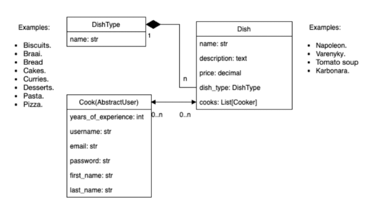

# restaurant-kitchen-service

Django Restaurant Services
A Django-based website to manage the kitchen services of a restaurant. This includes handling the creation dishes, dish types and cooks, as well as tracking years of experience.

DB Structure

# Features
Dish Management:
Handle all aspects of dish creation, updating, and deleting.
Update essential details like name, and pricing to keep your menu accurate and up-to-date.
Easily associate dishes with the appropriate dish types.

Dish Type Management:
Organize your menu by creating and managing various dish types.
Add, update, or delete dish types to ensure a clear and well-structured menu.

Cook Management:
Manage the kitchen staff with ease.
Create new cooks, or delete them when necessary.
Track their experience and assign them to specific dishes.

## Installation

## Clone the repository
git clone https://github.com/AndriiFn/restaurant-kitchen-service

## Navigate to the project directory
cd restaurant_kitchen_service

## Create a virtual environment
python3 -m venv venv

## Activate the virtual environment:

## On macOS/Linux:
source venv/bin/activate

## On Windows:
venv\Scripts\activate

## Install dependencies
pip install -r requirements.txt

## Run the Django development server
python manage.py runserver

=======

>>>>>>> c4487e1051407375e6295dedcd842074cd0b0824
